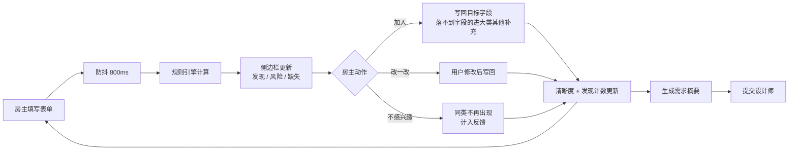

# 装修需求发现助手 · 产品设计文档

| 项目 | 内容 |
| --- | --- |
| 文档版本 | V1.1（对齐字段清单 V2 与 Demo V0.2） |
| 日期 | 2026-09-23 |
| 作者 | 李昕昊 |
| 状态 | 待评审 |
| 一句话说明 | 用纯规则，从房主已经填写的装修需求里，找出他想要但没说出口的需求 |
| 对应实现 | 字段清单 V2 · Demo V0.2（demo/装修需求发现助手_Demo_V0.2.html） |

---

## 一、产品定位

### 1.1 要解决的问题

装修是典型的高金额、低频、长周期决策。房主第一次装修时不懂专业术语，面对一份 191 个字段的需求表，通常只能填出"自己已经想到的"部分；而且很多问题（层高、管道位置、承重墙）在量房之前根本没法回答。

这部分没被说出口的需求不会消失，它会在后面的方案确认、施工、验收阶段以返工、增项、效果不符的形式重新出现。需求阶段漏掉一句话，后面就要用一轮修改和一笔增项来补。

### 1.2 我们要做的产品

装修需求发现助手：房主在填写需求表的过程中，系统持续读取已填内容，用确定性规则推导出他没有被问到、但与他的情况强相关的需求，并把每条发现变成可以一键落到表单字段的动作。

页面形态是左侧需求填写表格、右侧需求发现助手侧边栏。房主照常填表，助手在旁边安静地做三件事：发现他没想到的需求、提示他填的内容之间的矛盾、在提交前告诉他还有什么值得看一眼。

### 1.3 关键区分：补全与发现

这两件事必须分开，否则产品会退化成"缺项清单"。

| | 补全 | 发现 |
| --- | --- | --- |
| 判断依据 | 必填项没填 | 没被问到，但与已填内容强相关 |
| 驱动力 | 推荐项完成度 | 场景与生活方式 |
| 典型文案 | 请填写预算 | 因为你填了"高频下厨"，建议确认开放厨房的油烟方案 |
| 用户感受 | 你在催我交作业 | 你懂我 |

补全作为兜底保留，MVP 的主要投入放在发现上。

### 1.4 与筑云 HomeOS 的关系

本产品是筑云 HomeOS 房主端「需求确定」阶段的前置采集工具，也是整条 AI 流水线的起点：需求数据的完整度和准确度，直接决定下游设计师端方案的返工轮次。MVP 阶段只做好采集与发现本身，不接下游设计师端。输出物是两份材料：一份给业主核对的《需求意向书》，一份交给设计师的《量房确认清单》。

---

## 二、目标用户与使用场景

### 2.1 目标用户

| 画像 | 特征 | 对产品的含义 |
| --- | --- | --- |
| 小白型（首次装修） | 不懂术语，不知道自己想要什么，怕被坑 | 每条发现必须给出理由，术语必须解释 |
| 研究型（做过功课） | 有清单，在意细节，会质疑建议 | 尊重原始表达，建议可修改可拒绝 |
| 忙碌型（时间碎片） | 短句输入，跨天填写，容易中断 | 自动保存，断点恢复，摘要帮助快速回到上下文 |

MVP 优先服务小白型，因为他们的需求遗漏最严重，也最需要"被提醒"。

### 2.2 核心场景

**场景一：填到一半** 房主填完基础信息、客厅、厨房后停下来。此时侧边栏已经根据「89㎡、三口之家、高频下厨、有猫」推出若干条发现，按影响度排序展示，他在列表里逐条处理。

**场景二：填入矛盾信息** 房主选了"开放式厨房"，此前又填了"下厨频率：经常"。侧边栏出现风险提醒，说明油烟与燃气合规的影响，允许他保留原需求。

**场景三：提交前** 房主点提交设计师，侧边栏给出需求摘要和未处理的发现条数，他可以选择回头处理，也可以直接提交。

**场景四：只有两卧** 房主家只有两个房间，他不需要面对“其他卧室”的任何问题；确实需要儿童房时，点“添加次卧”、选完“儿童房”，相关字段才展开。

### 2.3 明确不做的场景

不做闲聊式问答，不做装修工艺知识解答，不做报价和工期承诺。助手只说与"把需求写全、写准"有关的话。

---

## 三、整体方案

### 3.1 页面结构

```
┌──────────────────────────────────────────┬───────────────────────┐
│ 需求填写        需求清晰度 ●●●○○ 68%     │ 需求发现助手          │
├──────────────────────────────────────────┤ 已发现 9 · 已处理 5   │
│ 1 认识你家        ▸ 已填                 ├───────────────────────┤
│ 2 玄关            ▸ 已填                 │ [P0] 开放式厨房油烟   │
│ 3 客厅            ▸ 已填                 │ 因为你填了"高频下厨"  │
│ 4 餐厅            ▸ 已填                 │ → 厨房 · 油烟方案     │
│ 5 厨房            ▾ 展开中               │  [加入][改一改][×]    │
│   ├ 下厨频率      [经常]                 │                       │
│   ├ 开放式厨房    [是] ← 点击发现项高亮  │ [P1] 猫砂盆位与防抓   │
│   └ 主要做饭人    [...]                  │ 因为你填了"养猫"      │
│ 6 阳台            ▸ 空                   │ → 厨房 · 其他补充     │
│ ...                                      │  [加入][改一改][×]    │
├──────────────────────────────────────────┤ 展开更多（还有 4 条） │
│ 已自动保存              [提交设计师]     │ 分区定位 ○●○●○●      │
└──────────────────────────────────────────┴───────────────────────┘
                                           │ [生成需求摘要][静默]  │
```

左侧表单按 13 个大类排列，折叠展开。其中其他卧室、卫生间、书房与电竞房是**空间实例**：可以增删，次卧按“次卧1、次卧2”命名，卫生间默认主卫与客卫，添加后先选房型，只显示与该房型相关的字段。

右侧侧边栏固定 360-400px，独立滚动，从上到下四段：

**进度头**：需求清晰度（推荐项完成比例）+ 发现计数（已发现几条、已处理几条），让用户始终知道还剩多少。因为不设必填项，这里不再是“必填完成度”。

**发现列表**：按优先级排序的卡片，每条包含标题、一句依据（固定写成"因为你填了……"）、目标字段标签、三个动作按钮。同屏最多展开 3 条，其余折叠。

**分区定位**：13 个进度点，显示哪个大类还空着，点击滚动到该大类。

**底部操作**：生成需求摘要、进入静默模式。

### 3.2 核心流程



几个必须遵守的约束：AI 不静默修改表单，写入必须经用户确认；字段已有值时替换要二次确认；采纳后的内容可撤销；删除已有内容的空间实例要二次确认。

### 3.3 需求表结构

需求表分两层。第一层是业主能直接回答的**表单字段**：以实际设计工作使用的《设计需求表》为主干、合并同类项后，形成 13 个大类、191 个字段，其中 9 项标为「推荐填写」、2 项为实例必选，没有任何必填项。第二层是**量房确认清单**：16 项需要现场核实的内容，不进表单，量房时交给设计师逐条确认。字段清单见 `outputs/01a0c95f-3b4f-7762-ad52-61bb13941fcc/装修需求采集表_字段清单_V2.xlsx`。

| 分区 | 字段数 | 说明 |
| --- | --- | --- |
| 认识你家 | 43 | 房屋情况、居住成员、预算工期、风格与生活方式、特殊需求 |
| 设备与系统 | 9 | 空调采暖、水与热水、智能与弱电，跨空间统一填报 |
| 玄关 | 13 | |
| 客厅 | 12 | |
| 餐厅 | 9 | |
| 厨房 | 18 | |
| 阳台 | 12 | |
| 主卧 | 14 | |
| 其他卧室 | 12 | 可增删实例，选完房型后只显示相关字段 |
| 书房与电竞房 | 13 | 可增删实例 |
| 卫生间 | 21 | 可增删实例，默认主卫与客卫，各填一次 |
| 收纳与家政 | 11 | 衣帽间、储物间、家政柜 |
| 补充说明 | 4 | 自由填写与场景描述 |

### 3.4 采集边界：只问业主答得上的

需求采集发生在设计师量房之前，业主手上通常没有房子的具体信息。判断一个字段该不该进表单，看三个问题：业主凭生活经验能回答吗？答错会不会比不答更糟？量房时由设计师来问是不是更合适？任何一条不满足，就移出表单。

按这个标准，层高、承重墙与梁位、上下水点位、同层排水条件、配电回路、定制柜安装深度、地面完成面衔接、大件电器尺寸等 16 项内容不进表单，转为《量房确认清单》，量房时由设计师现场逐条确认。这不是把问题丢掉，而是把它放到正确的环节——对设计师来说，带着清单上门，比拿到一份业主猜出来的数据更有价值。

配套的三条设计决定：一是不设必填项，全部为「推荐填写」或「选填」，推荐填写不阻断提交，只影响需求清晰度；二是涉及专业判断的字段都提供「不清楚 / 听设计师建议」选项；三是表单用生活化表达，例如"希望打开就有热水"而不是"热水循环"。

每个字段带字段 ID、大类、控件类型、选项、填写建议（推荐填写 / 实例必选 / 选填）、空间类型、适用房型、发现规则触发点、来源，可直接作为前端数据键使用。空间实例上限：次卧 4、卫生间 3、书房与电竞房 2。

---

## 四、主要功能

### 4.1 功能清单

| 编号 | 功能 | 优先级 | 说明 |
| --- | --- | --- | --- |
| F1 | 实时发现引擎 | P0 | 纯规则计算，读取表单快照输出发现项 |
| F2 | 发现卡片与三动作闭环 | P0 | 加入 / 改一改 / 不感兴趣，写入标记 AI 建议 |
| F3 | 需求清晰度与发现计数 | P0 | 推荐项完成比例 + 发现处理数，不设必填 |
| F4 | 断点恢复 | P1 | 自动保存草稿，回来先看"还有几条待处理" |
| F5 | 需求摘要生成 | P1 | 模板拼装已填字段与已确认发现，用于提交 |
| F6 | 静默模式 | P1 | 连续 3 次不感兴趣后停止主动提示，入口常驻可恢复 |
| F7 | 空间实例管理 | P0 | 其他卧室 / 卫生间 / 书房可增删，房型决定显示哪些字段 |
| F8 | 量房确认清单 | P1 | 16 项现场确认内容，随需求意向书一起交给设计师 |

### 4.2 F1 实时发现引擎

MVP 采用纯规则实现，不做模型调用。规则可解释、可枚举、可测试、零成本，而且天然满足"每条发现都必须有依据"这个底线。

三类机制：

| 机制 | 逻辑 | 示例 |
| --- | --- | --- |
| 关联推导 | 有 A 通常需要 B | 养猫 → 猫砂盆位、防抓材质、扫地机器人位置；下厨频率高 → 台面高度、备餐动线 |
| 冲突风险 | 已填内容之间存在矛盾 | 开放式厨房 × 高频中式烹饪；预算与面积严重不匹配；入住时间临近 × 定制家具周期 |
| 场景挖掘 | 家庭结构与生活方式推导场景 | 三口之家且无独立书房 → 学习区位置；有老人同住 → 无障碍与防滑；在家办公 → 网口与隔音 |

### 4.3 F2 发现卡片与动作闭环

每张卡片固定四段：标题、依据（"因为你填了 X"）、目标字段、三个动作。

加入：优先写入目标字段；落不到字段的文字类建议写入该建议所属大类的“其他补充”，打上 AI 建议标记，可撤销。
改一改：允许用户修改文案后再写入，用于研究型用户。
不感兴趣：同类发现不再出现，计入反馈；连续 3 次进入静默模式。

没有这个闭环，发现就只是一条广告。闭环同时也是后续优化规则的唯一数据来源。

### 4.4 F3 双进度指标

需求清晰度按推荐填写项计算：已填推荐项 / 推荐项总数（含已添加空间实例内的推荐项）。发现处理数：已发现多少条、已处理多少条。两个数字分开显示，避免用户把"发现"理解成"又多了活"；因为不设必填项，跳过任何字段都不会被判为未完成。

### 4.5 F4 断点恢复

离开页面自动保存。再次进入时侧边栏顶部只显示一行摘要：你已确认 6 条发现，还有 3 条待看。点击继续处理，不做弹窗提醒。

### 4.6 F5 需求摘要生成

把已填字段与已确认的发现拼成一段人话，供房主提交给设计师。MVP 用模板拼装，不调用模型。摘要长度控制在 150 字以内，关键参数用表格列出，与表单内容保持一致。

### 4.7 F6 静默模式

连续拒绝 3 条发现后自动进入静默：停止主动提示，只保留用户主动查看。侧边栏底部常驻"恢复建议"按钮。静默状态记入本次需求会话，不做跨会话继承。

### 4.8 交互细则

表单变化后防抖 800ms 再更新侧边栏，用户正在输入时不弹提示。

点击发现卡片，左侧表单滚动到目标字段并高亮 2 秒。

采纳后的卡片不消失，变绿下沉，让用户看到处理结果。

同一条发现会话内只出现一次，风险提醒被"保持需求"后不再重复出现。

---

## 五、发现规则设计

### 5.1 规则结构

每条规则由七部分组成：作用域、触发条件、发现文案、目标字段、写入动作、优先级、依据说明。作用域分两类：固定字段规则（如“养猫 → 猫砂盆位”）与空间实例规则（如“任一卫生间选了浴缸 → 提示确认尺寸与给排水”），后者按实例分别计算，卡片上会标明属于哪个空间。目标字段必须存在于字段清单白名单内，写入动作只允许追加或替换。

```json
{
  "id": "rule-open-kitchen",
  "trigger": { "kt_form": "开放式", "kt_freq": "经常" },
  "text": "开放式厨房搭配高频下厨，建议确认油烟方案与燃气备案要求",
  "target_field": "kt_hood",
  "action": "append",
  "priority": "P0",
  "reason": "因为你填了「下厨频率：经常」和「厨房形式：开放式」",
  "refs": []
}
```

### 5.2 MVP 规则覆盖

首版按大类铺开，每个大类 3-8 条，总计约 60 条规则，优先覆盖认识你家、厨房、卫生间、主卧、阳台这几个高影响大类，其中约四分之一是空间实例规则。规则表单独维护，与字段清单解耦，便于持续补充而不改页面。

---

## 六、版本规划与产品边界

### 6.1 版本节奏

| 版本 | 范围 | 验证的假设 |
| --- | --- | --- |
| V1.0（本次，Demo V0.2 已实现） | 房主端 Web 填写页（含空间实例增删）+ 纯规则发现引擎 + 需求摘要 | 规则驱动的发现能不能被用户接受并采纳 |
| V1.1 | 规则扩充、需求摘要导出、发现历史 | 发现数量与质量是否随规则增长而提升 |
| V2.0 | 对话式补充录入、模型辅助场景挖掘、App 端 | 自然语言输入能否显著提高需求清晰度 |

每个版本只验证一组假设，通过后再投入下一版。

### 6.2 明确不做

不做闲聊式对话，不做装修工艺与材料知识解答，不做报价与工期承诺，不静默改写用户已填内容，不做多角色与权限体系，不做跨项目记忆继承。以上每一项都留到后续版本，塞进 MVP 只会让"发现"这个核心价值失焦。

---

## 七、关键指标

| 指标 | 定义 | 目标值 |
| --- | --- | --- |
| 发现采纳率 | 采纳数 / 发现展示数 | ≥ 30% |
| 提交时推荐项完成率 | 提交时已填推荐项 / 全部推荐项 | ≥ 80% |
| 不感兴趣率 | 不感兴趣数 / 发现展示数 | < 40% |
| 填写时长 | 首次进入至提交 | 相比现状下降 30% |
| 静默触发率 | 进入静默的会话占比 | < 5% |

验证方式：准备三个种子场景（首次装修小白、养猫的三口之家、改善型换房），跑通端到端流程，观察发现条数与采纳率是否达标。

---

## 八、待确认项

| # | 类型 | 内容 |
| --- | --- | --- |
| 1 | 必须确认 | 《需求意向书》与《量房确认清单》先做成可打印页面，还是直接打通设计师端 |
| 2 | 建议确认 | 推荐填写 9 项是否合适；填写负担需在真实用户上实测（191 个字段中推荐 9 项、实例必选 2 项、其余选填、无必填） |
| 3 | 建议确认 | 发现卡片同屏展示 3 条是否合适，需要真机验证 |
| 4 | 建议确认 | 需求摘要的字数与格式规范，是否需要支持导出图片 |
| 5 | 可后续补充 | 埋点方案与指标看板的具体实现 |
| 6 | 可后续补充 | 规则表的管理方式：配置文件还是后台可编辑 |
| 7 | 建议确认 | 空间实例上限（次卧 4 / 卫生间 3 / 书房 2）是否符合真实户型分布 |
| 8 | 可后续补充 | 跨实例规则是否需要提示，例如两间次卧都设为儿童房 |

---

**文档结束** | 装修需求发现助手 · 产品设计文档 V1.1 | 2026-09-23
