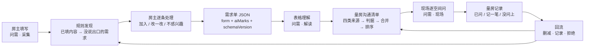
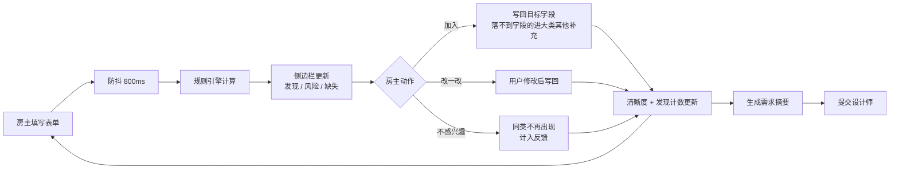

# 问需 · 产品设计文档

| 项目 | 内容 |
| --- | --- |
| 文档版本 | V1.0（首次合并：原《装修需求发现助手 · 产品设计文档》V1.2 + 原《设计需求解读台 · 产品设计文档》V0.11） |
| 日期 | 2026-09-24 |
| 作者 | 李昕昊 |
| 状态 | 待评审 |
| 一句话说明 | 把装修需求问全、问清、问定 |
| 端形态 | 问需 · 采集（房主：微信小程序 / Web / 展示版）· 问需 · 解读（设计师：桌面工作台）· 问需 · 现场（设计师：手机 PWA） |
| 对应实现 | 采集端 `app/` · 桌面工作台 `studio/` · 现场端 `onsite/` · API 服务 `services/api/` · 领域包 `packages/` |
| 配套文档 | 《问需 · 技术方案》 |

**这份文档由两份合并而来。** 原先的《装修需求发现助手》与《设计需求解读台》被当成两个产品写，但它们在数据上本来就是一条链：采集端是为了给解读台提供输入而存在的，解读台读的正是采集端导出的需求单。合并后按「采集 → 解读 → 现场 → 回流」四个环节组织，端作为环节，不再是独立产品。合并时删掉了两处已经过时的边界（原采集端文档曾声明这一阶段不接设计师端），并补上原先两边都提到、但哪边都没正式设计的**回流闭环**。

---

## 一、产品定位

### 1.1 要解决的问题

装修是典型的高金额、低频、长周期决策。需求从房主脑子里到设计师手里，会漏两次。

**第一次漏水在房主端。** 房主第一次装修时不懂专业术语，面对一份 191 个字段的需求表，通常只能填出「自己已经想到的」部分；而且很多问题（层高、管道位置、承重墙）在量房之前根本没法回答。

**第二次漏水在设计师端。** 一份填好的需求单交到设计师手上，正确用法不是照着做方案：房主答不准涉及现场条件的判断，需求单也装不下房主的全部意图（没说出口的、自己还没想清楚的）。照着做，到现场才发现做不了。

这部分没被说出口、没被问清楚的需求不会消失，它会在方案确认、施工、验收阶段以返工、增项、效果不符的形式重新出现。需求阶段漏掉一句话，后面就要用一轮修改和一笔增项来补。

### 1.2 我们要做的产品

问需是一条从房主到现场的完整链路，三个阶段回答同一个问题的三面：

| 环节 | 端 | 做什么 |
| --- | --- | --- |
| **问全** | 问需 · 采集 | 房主填表时，系统持续读取已填内容，用确定性规则推导出他没被问到、但与他的情况强相关的需求，每条发现都能一键落到表单字段 |
| **问清** | 问需 · 解读 | 把填好的需求单变成设计师出门前看得懂的解读，和一份到现场可以照着问的《量房沟通清单》 |
| **问定** | 问需 · 现场 | 设计师按空间逐条走，问完记一句话结论，问不了记一句原因，带一份量房记录回来 |

三个端的字段、规则、文案、判据、指标完全一致，差异只在布局与动线。

### 1.3 三个端的分工

| | 问需 · 采集 | 问需 · 解读 | 问需 · 现场 |
| --- | --- | --- | --- |
| 用户 | 房主 | 本公司设计师 | 本公司设计师 |
| 在哪用 | 手机上填需求单 | 公司电脑，出门前 | 现场，单手拿着手机 |
| 动线 | 填表 → 逐条处理发现 → 生成摘要 → 提交 | 导入 → 确认外发 → 看理解 → 筛清单 → 导出 | 选单 → 出门前过一遍 → 逐空间问 → 结束看记录 |
| 是否用模型 | 不用，纯确定性规则 | 用（语义解读），且必须能溯源到字段 | 不用 |
| 产出 | 需求单（结构化 JSON）· 需求摘要 · 量房确认清单 16 项 | 表格理解 · 量房沟通清单 | 量房记录 |
| 上线形态 | 微信小程序（正式）+ Web + 展示版 | 网页（公司内部工具） | PWA，可装到手机主屏幕 |

### 1.4 关键区分：补全与发现

这两件事必须分开，否则采集端会退化成「缺项清单」。

| | 补全 | 发现 |
| --- | --- | --- |
| 判断依据 | 必填项没填 | 没被问到，但与已填内容强相关 |
| 驱动力 | 推荐项完成度 | 场景与生活方式 |
| 典型文案 | 请填写预算 | 因为你填了「高频下厨」，建议确认开放厨房的油烟方案 |
| 用户感受 | 你在催我交作业 | 你懂我 |

补全作为兜底保留，投入主要放在发现上。

### 1.5 与筑云 HomeOS 的关系

采集端是筑云 HomeOS 房主端「需求确定」阶段的前置采集工具，也是整条链路的数据起点（采集端自身不调用模型，只用确定性规则，见 4.7）：需求数据的完整度和准确度，直接决定设计师端方案的返工轮次。解读端与现场端是公司内部工具，只服务本公司，不对外注册、不做多租户。

### 1.6 明确不做

不做闲聊式对话，不做装修工艺与材料知识解答，不做报价与工期承诺，不静默改写用户已填内容，不做房主端与设计师端的即时沟通，不做解读台的小程序版本，不做跨项目记忆继承。以上每一项都留到后续版本，塞进 MVP 只会让「把需求问清楚」这件事失焦。

---

## 二、一条链路

### 2.1 总流程



### 2.2 每一段的输入与产出

| 环节 | 输入 | 产出 | 谁在用 |
| --- | --- | --- | --- |
| 采集 | 房主的生活经验 | 结构化需求单（字段值 + 空间实例 + 助手来源标记） | 解读端 |
| 解读 | 需求单 + 字段清单版本 | 表格理解 + 量房沟通清单 | 现场端、设计师 |
| 现场 | 清单 + 房主的原填内容 | 量房记录（哪条问了、结论是什么、哪条没落） | 设计师、回流 |
| 回流 | 删减动作 + 现场记录 + 房主拒绝 | 规则与判据的调整 | 下一份需求单 |

### 2.3 贯穿三端的一份数据

三条硬性的资产是同一份，不允许各端各建一套：

1. **字段清单是唯一来源**：以实际设计工作使用的《设计需求表》为主干、合并同类项后，形成 13 个大类、191 个字段；配套 16 项《量房确认清单》不进表单，量房时现场逐条确认。字段清单从 Excel 导出为 JSON，前端渲染、规则引擎、清单判据、摘要生成全部引用它。
2. **助手来源标记（aiMarks）**：采集端标出哪些字段是助手建议写入的，解读端据此在原始表格视图里区分「房主填写 / 助手建议」。房主填的与他人代填的，意思不一样。
3. **版本与规范化**：需求单带 `schemaVersion`，读入时按版本做一次规范化。版本对不上时不静默丢弃：未知字段保留原值，并在界面上标注「字段清单已更新」，让设计师看得见差异。

清单条目的**稳定标识不能带分组**。分组会随产品判断调整（已经改过一次，把「全屋」拆成了「基本信息 + 空间」），清单也会重新生成；现场记录如果靠分组或条目主键去对应，改一次分组、重新生成一次清单，记录就断了。稳定的键是「核实对象 + 主要来源字段」。

### 2.4 链路上的三条硬约束

- **助手不静默修改表单**：写入必须经用户确认；字段已有值时替换要二次确认；采纳后的内容可撤销；删除已有内容的空间实例要二次确认。
- **不编造房主没说过的需求**：每条结论必须能指到字段，或明确标为来自通用量房清单。
- **现场记录与清单分离**：清单是生成物（换模型、调判据都可以重新生成），现场记录是资产（是「清单有没有用」的唯一证据，也是回头调判据的数据源），不能被重新生成覆盖掉。现场记录只回答「问没问、问出了什么」，不回改清单本身，也不在现场端修正房主原填的内容。

---

## 三、目标用户与场景

### 3.1 房主

| 画像 | 特征 | 对产品的含义 |
| --- | --- | --- |
| 小白型（首次装修） | 不懂术语，不知道自己想要什么，怕被坑 | 每条发现必须给出理由，术语必须解释 |
| 研究型（做过功课） | 有清单，在意细节，会质疑建议 | 尊重原始表达，建议可修改可拒绝 |
| 忙碌型（时间碎片） | 短句输入，跨天填写，容易中断 | 自动保存，断点恢复，摘要帮助快速回到上下文 |

优先服务小白型，因为他们的需求遗漏最严重，也最需要「被提醒」。

### 3.2 设计师

设计师是解读端与现场端的用户，只服务本公司。三类画像里的「小白型」房主已经在采集端被服务过；到这一步，需求单的完整度决定设计师能拿到多少信息。

### 3.3 典型场景

**填到一半。** 房主填完基础信息、客厅、厨房后停下来。侧边栏已根据「89㎡、三口之家、高频下厨、有猫」推出若干条发现，按影响度排序，他逐条处理。

**填入矛盾信息。** 房主选了「开放式厨房」，此前又填了「下厨频率：经常」。侧边栏出现风险提醒，说明油烟与燃气合规的影响，允许他保留原需求。

**提交前。** 房主点提交设计师，侧边栏给出需求摘要和未处理的发现条数，他可以选择回头处理，也可以直接提交。

**只有两卧。** 房主家只有两个房间，他不需要面对「其他卧室」的任何问题；确实需要儿童房时，点「添加次卧」、选完「儿童房」，相关字段才展开。

**出门前。** 设计师收到客户的需求单，导入后花几分钟过一遍清单，知道这次出门要问清楚哪几件事；出门前在手机上再看一眼「必问里还剩哪几条」。

**现场。** 手机上打开这一家的清单，一个空间一个空间走：问完点「已问」，值得留痕的点「记一笔」当场记一句话结论，来不及问的标「没问上」。现场没信号也照常记，回到有网的地方自动同步。

**结束与回来之后。** 当场拿到一份量房记录：哪条问了、结论是什么、哪条没落。这份记录和清单上的删减动作一起，是「判据准不准」的唯一证据——它决定下一版把哪些问题从清单里拿掉、哪些补进去。

### 3.4 成功的样子

设计师不必临场回忆「这家人当时填了什么」，也不必赌房主那句模糊表达到底是什么意思；房主不必在方案做出来之后才发现「我不是这个意思」。

---

## 四、问需 · 采集（房主端）

### 4.1 页面结构

两端共用同一套字段、规则与文案，差异只在布局与导航方式。

#### 桌面端（Web）

```
┌──────────────────────────────────────────┬───────────────────────┐
│ 需求填写        需求清晰度 ●●●○○ 68%     │ 需求发现助手          │
├──────────────────────────────────────────┤ 已发现 9 · 已处理 5   │
│ 1 认识你家        ▸ 已填                 ├───────────────────────┤
│ 2 玄关            ▸ 已填                 │ [P0] 开放式厨房油烟   │
│ 3 客厅            ▸ 已填                 │ 因为你填了"高频下厨"  │
│ 4 餐厅            ▸ 已填                 │ → 厨房 · 油烟方案     │
│ 5 厨房            ▾ 展开中               │  [加入][改一改][×]    │
│   ├ 下厨频率      [经常]                 │                       │
│   ├ 开放式厨房    [是] ← 点击发现项高亮  │ [P1] 猫砂盆位与防抓   │
│   └ 主要做饭人    [...]                  │ 因为你填了"养猫"      │
│ 6 阳台            ▸ 空                   │ → 厨房 · 其他补充     │
│ ...                                      │  [加入][改一改][×]    │
├──────────────────────────────────────────┤ 展开更多（还有 4 条） │
│ 已自动保存              [提交设计师]     │ 分区定位 ○●○●○●      │
└──────────────────────────────────────────┴───────────────────────┘
                                           │ [生成需求摘要][静默]  │
```

左侧表单按 13 个大类排列，折叠展开。其中其他卧室、卫生间、书房与电竞房是**空间实例**：可以增删，次卧按「次卧1、次卧2」命名，卫生间默认主卫与客卫，添加后先选房型，只显示与该房型相关的字段。

右侧侧边栏固定 360-400px，独立滚动，从上到下四段：

**进度头**：需求清晰度（推荐项完成比例）+ 发现计数（已发现几条、已处理几条）。因为不设必填项，这里不是「必填完成度」。

**发现列表**：按优先级排序的卡片，每条包含标题、一句依据（固定写成「因为你填了……」）、目标字段标签、三个动作按钮。同屏最多展开 3 条，其余折叠。

**分区定位**：13 个进度点，显示哪个大类还空着，点击滚动到该大类。

**底部操作**：生成需求摘要、进入静默模式。

#### 手机端（微信小程序）

```
┌─────────────────────────────┐
│ 装修需求采集          ··· ◉ │
│ ▓▓▓▓▓░░░░░   清晰度 38%     │
│ [认识你家][设备与系统][玄关]→│
├─────────────────────────────┤
│ ① 认识你家          12/43 ▾ │
│ ② 设备与系统         0/9  ▸ │
│ ③ 玄关               3/13 ▸ │
│ …                           │
├─────────────────────────────┤
│ ✦ 还有 4 条发现值得看一眼 › │
│ 已自动保存      [提交设计师] │
└─────────────────────────────┘
```

**大类手风琴**：13 个大类一次只展开一个，折叠时显示已填数量。桌面端能一次铺开的长表单，在手机上必须先解决「找不到北」。

**分区导航改横滑**：13 个竖直进度点在手机上放不下，改成顶部横向滑动的胶囊，点击跳转并展开对应大类，当前位置自动高亮。

**助手收进底部横条**：桌面端常驻的 360px 侧栏在手机上会一直占掉半屏，改成底部常驻横条（「还有 N 条发现值得看一眼」），点击从底部升起半屏弹层，可下滑关闭、上滑全屏。

**按需渲染**：只渲染展开的那个大类，其余不生成节点。这既是手机的滚动性能考虑，也贴合小程序 setData 要少传数据的约束。

**摘要整页展示**：手机上小弹窗读长文本体验差，改成整页滑出，底部常驻复制。采纳或忽略后的卡片不消失，变绿下沉到「最近处理」，让房主看得到处理结果。

### 4.2 核心流程



### 4.3 需求表结构

需求表分两层。第一层是业主能直接回答的**表单字段**：13 个大类、191 个字段，其中 9 项标为「推荐填写」、2 项为实例必选，没有任何必填项。第二层是**量房确认清单**：16 项需要现场核实的内容，不进表单，量房时交给设计师逐条确认。

| 分区 | 字段数 | 说明 |
| --- | --- | --- |
| 认识你家 | 43 | 房屋情况、居住成员、预算工期、风格与生活方式、特殊需求 |
| 设备与系统 | 9 | 空调采暖、水与热水、智能与弱电，跨空间统一填报 |
| 玄关 | 13 | |
| 客厅 | 12 | |
| 餐厅 | 9 | |
| 厨房 | 18 | |
| 阳台 | 12 | |
| 主卧 | 14 | |
| 其他卧室 | 12 | 可增删实例，选完房型后只显示相关字段 |
| 书房与电竞房 | 13 | 可增删实例 |
| 卫生间 | 21 | 可增删实例，默认主卫与客卫，各填一次 |
| 收纳与家政 | 11 | 衣帽间、储物间、家政柜 |
| 补充说明 | 4 | 自由填写与场景描述 |

每个字段带字段 ID、大类、控件类型、选项、填写建议（推荐填写 / 实例必选 / 选填）、空间类型、适用房型、发现规则触发点、来源，可直接作为前端数据键使用。空间实例上限：次卧 4、卫生间 3、书房与电竞房 2。

### 4.4 采集边界：只问业主答得上的

需求采集发生在设计师量房之前，业主手上通常没有房子的具体信息。判断一个字段该不该进表单，看三个问题：业主凭生活经验能回答吗？答错会不会比不答更糟？量房时由设计师来问是不是更合适？任何一条不满足，就移出表单。

按这个标准，层高、承重墙与梁位、上下水点位、同层排水条件、配电回路、定制柜安装深度、地面完成面衔接、大件电器尺寸等 16 项内容不进表单，转为《量房确认清单》，量房时由设计师现场逐条确认。这不是把问题丢掉，而是把它放到正确的环节——对设计师来说，带着清单上门，比拿到一份业主猜出来的数据更有价值。

配套的三条设计决定：一是不设必填项，全部为「推荐填写」或「选填」，推荐填写不阻断提交，只影响需求清晰度；二是涉及专业判断的字段都提供「不清楚 / 听设计师建议」选项；三是表单用生活化表达，例如「希望打开就有热水」而不是「热水循环」。

### 4.5 端形态与实现方式

| 形态 | 给谁用 | 定位 |
| --- | --- | --- |
| 微信小程序 | 房主手机 | 产品的手机载体；代码已能构建，发布需要小程序账号、微信开发者工具与提审 |
| 手机版（H5 窄屏 + 可装机） | 房主手机 | 正式产品：窄屏即手机形态，带 manifest 与 service worker，可添加到主屏幕；断网也能打开，草稿存在本机 |
| Web | 房主电脑 | 正式产品，长期维护 |
| 展示版 | 演示与作品展示 | 与手机版是同一份产物，在浏览器里看手机形态的预览，不承担产品职责 |

**实现方式**：用 Taro + React + TypeScript 一套代码产出微信小程序与 H5 两个产物，H5 在宽屏下的表现就是 Web 端。跨端复用的核心不是界面，而是抽成纯 TypeScript 的领域包——字段规格、规则引擎、摘要生成、草稿读写。判定这套方案是否成立的信号只有一个：布局分支必须止步于壳组件（表单容器、助手容器、分区导航），一旦平台判断开始渗透到单个字段的渲染里，就拆成两套界面、共用一个领域包。

**随之固定的技术约束**：字段渲染由元数据驱动，191 个字段不手写组件；规则表是数据不是代码，与字段清单解耦，后续要支持云端覆盖，规则调整不发版；发现列表按 P0 → P1 → P2 排序，风险提醒优先。

### 4.6 功能清单

| 编号 | 功能 | 优先级 | 说明 |
| --- | --- | --- | --- |
| F1 | 实时发现引擎 | P0 | 纯规则计算，读取表单快照输出发现项 |
| F2 | 发现卡片与三动作闭环 | P0 | 加入 / 改一改 / 不感兴趣，写入标记助手建议 |
| F3 | 需求清晰度与发现计数 | P0 | 推荐项完成比例 + 发现处理数，不设必填 |
| F4 | 断点恢复 | P1 | 自动保存草稿，回来先看「还有几条待处理」 |
| F5 | 需求摘要生成 | P1 | 模板拼装已填字段与已确认发现，用于提交 |
| F6 | 静默模式 | P1 | 连续 3 次不感兴趣后停止主动提示，入口常驻可恢复 |
| F7 | 空间实例管理 | P0 | 其他卧室 / 卫生间 / 书房可增删，房型决定显示哪些字段 |
| F8 | 量房确认清单 | P1 | 16 项现场确认内容，随需求意向书一起交给设计师 |
| F9 | 需求单结构化导出 | P0 | 把表单值与助手来源标记导出成需求单 JSON，交给解读端（见 5.1） |

### 4.7 F1 实时发现引擎

**产品判断：发现引擎是确定性规则，这里刻意不交给模型。**

MVP 采用纯规则实现，不做模型调用。这一条是产品判断，不是阶段性的技术妥协：发现本质是「已填内容 → 关联需求」的确定映射（养猫 → 猫砂盆位），触发条件与结论都能枚举，规则可解释、可枚举、可测试、零成本，而且天然满足「每条发现都必须有依据」这个底线。

模型解决的是另一类问题——把模糊表达转成结构化字段，那是后续版本的对话式补充录入。届时模型只产出候选文案，写回仍走同一条用户确认链路。因此本端不对外宣称 AI 能力，页面上统一写「助手建议」。

三类机制：

| 机制 | 逻辑 | 示例 |
| --- | --- | --- |
| 关联推导 | 有 A 通常需要 B | 养猫 → 猫砂盆位、防抓材质、扫地机器人位置；下厨频率高 → 台面高度、备餐动线 |
| 冲突风险 | 已填内容之间存在矛盾 | 开放式厨房 × 高频中式烹饪；预算与面积严重不匹配；入住时间临近 × 定制家具周期 |
| 场景挖掘 | 家庭结构与生活方式推导场景 | 三口之家且无独立书房 → 学习区位置；有老人同住 → 无障碍与防滑；在家办公 → 网口与隔音 |

### 4.8 F2 发现卡片与动作闭环

每张卡片固定四段：标题、依据（「因为你填了 X」）、目标字段、三个动作。

加入：优先写入目标字段；落不到字段的文字类建议写入该建议所属大类的「其他补充」，打上助手建议标记，可撤销。
改一改：允许用户修改文案后再写入，用于研究型用户。
不感兴趣：同类发现不再出现，计入反馈；连续 3 次进入静默模式。

没有这个闭环，发现就只是一条广告。闭环同时也是后续优化规则的唯一数据来源（见第七章）。

### 4.9 F3 双进度指标

需求清晰度按推荐填写项计算：已填推荐项 / 推荐项总数（含已添加空间实例内的推荐项）。发现处理数：已发现多少条、已处理多少条。两个数字分开显示，避免用户把「发现」理解成「又多了活」；因为不设必填项，跳过任何字段都不会被判为未完成。

### 4.10 交互细则

- 表单变化后防抖 800ms 再更新侧边栏，用户正在输入时不弹提示。
- 点击发现卡片，左侧表单滚动到目标字段并高亮 2 秒。
- 采纳后的卡片不消失，变绿下沉，让用户看到处理结果。
- 同一条发现会话内只出现一次，风险提醒被「保持需求」后不再重复出现。
- 离开页面自动保存。再次进入时侧边栏顶部只显示一行摘要：你已确认 6 条发现，还有 3 条待看。点击继续处理，不做弹窗提醒。
- 连续拒绝 3 条发现后自动进入静默：停止主动提示，只保留用户主动查看，侧边栏底部常驻「恢复建议」按钮。静默状态记入本次需求会话，不做跨会话继承。

### 4.11 需求摘要

把已填字段与已确认的发现拼成一段人话，供房主提交给设计师。用模板拼装，不调用模型。摘要长度控制在 150 字以内，关键参数用表格列出，与表单内容保持一致。

### 4.12 规则设计

每条规则由七部分组成：作用域、触发条件、发现文案、目标字段、写入动作、优先级、依据说明。作用域分两类：固定字段规则（如「养猫 → 猫砂盆位」）与空间实例规则（如「任一卫生间选了浴缸 → 提示确认尺寸与给排水」），后者按实例分别计算，卡片上会标明属于哪个空间。目标字段必须存在于字段清单白名单内，写入动作只允许追加或替换。

```json
{
  "id": "rule-open-kitchen",
  "trigger": { "kt_form": "开放式", "kt_freq": "经常" },
  "text": "开放式厨房搭配高频下厨，建议确认油烟方案与燃气备案要求",
  "target_field": "kt_hood",
  "action": "append",
  "priority": "P0",
  "reason": "因为你填了「下厨频率：经常」和「厨房形式：开放式」",
  "refs": []
}
```

首版按大类铺开，每个大类 3-8 条，总计约 60 条规则，优先覆盖认识你家、厨房、卫生间、主卧、阳台这几个高影响大类，其中约四分之一是空间实例规则。规则表单独维护，与字段清单解耦，便于持续补充而不改页面。

---

## 五、问需 · 解读（设计师端）

### 5.1 输入：需求单 JSON

输入是采集端导出的一个 JSON，需要包含三部分：

| 部分 | 内容 | 来源 |
| --- | --- | --- |
| 表单数据 | 固定字段值与各空间实例的值，以字段 ID 为键 | 采集端的 form model |
| 助手来源标记 | 哪些字段是助手建议写入的 | 采集端的 aiMarks |
| 元信息 | 提交时间、字段清单版本（schemaVersion）、来源 | 采集端 |

采集端目前只导出一段摘要文本，**给它加一个结构化导出是这条链路的前置任务**——不做这一步，解读端拿不到可以理解的数据。采集端将来会直接提交到云端，文件导入只是同一个接口的另一种输入方式。

### 5.2 核心产出：量房沟通清单

一份需求单交到设计师手上时，有价值的信息不只是「房主写了什么」，而是：

- 还有哪些没定？
- 哪些可能冲突？
- 哪些必须到现场才能确认？

这三个问题的答案就是核心产出。每条清单项的结构：

| 字段 | 说明 | 例 |
| --- | --- | --- |
| 问题 | 要当面问什么 | 厨房是否接受开放式 |
| 为什么问 | 依据 | 房主填了「下厨频率：经常」且「厨房形式：开放式」 |
| 现场要核实 | 需要现场条件才能判断的部分 | 烟道位置、排烟条件、燃气备案要求 |
| 关联字段 | 点回原始表格 | 厨房 · 下厨频率、厨房形式 |
| 分类 | 便于现场按空间走 | 厨房 |

### 5.3 清单项从哪来

四个来源产生的是候选，最终谁进清单由 5.4 的判据决定；其中前三个由数据推导，第四个是现成资产：

| 来源 | 说明 | 谁生成 |
| --- | --- | --- |
| 空缺的推荐项 | 推荐填写 9 项里没填的 | 规则（确定） |
| 房主答「不清楚」的项 | 采集端在涉及专业判断的字段上专门给了「不清楚 / 听设计师建议」选项，这些话等于房主明说「我不确定，你来定」，是量房时最该聊的 | 规则（确定） |
| 从已填内容推导的问题 | 由需求组合推出的、需要当面确认的点 | 模型生成 |
| 通用量房确认清单 | 采集端已有的 16 项现场核实内容；按来源字段归入各自的分区（结构与尺寸类归「基本信息」，管线与设备类归「设备与系统」） | 现成资产 |

第三条是模型唯一负责的部分。也因此，模型在这里的回答只有一种形态：**一条能被追问、能被设计师判断的问题**，而不是一个结论。

### 5.4 什么该进清单：按判据筛，不按条数筛

清单只放关键信息，但「关键」必须有可判定的标准，否则会退化成「把表格念一遍」。一条信息进入清单，当且仅当它满足下面任意一条：

| 判据 | 含义 | 例 |
| --- | --- | --- |
| 影响可行性 | 现场条件可能让这个需求落不了地 | 开放式厨房 + 高频下厨 → 烟道位置与排烟条件 |
| 影响方向 | 答案不同，方案方向就不同 | 房主写「想要简单一点」→ 原木、奶油还是现代简约 |
| 影响成本或工期 | 与预算、入住时间冲突 | 预算 20 万 + 全屋定制 + 计划三个月入住 |

反过来，不满足任何一条的不进清单。典型的「不该进」有三类：

- 房主已经答清楚、且与现场条件无关的（写了「电视」就不必再问要不要电视）；
- 字段空着但答案对方案没有影响的（某个「其他补充」没填）；
- 只是罗列信息，不构成一个要当面确认的问题的。

**只要是关键信息就都列出，不设条数上限。** 用条数卡清单，砍掉的往往是真正重要的问题，这条线不划算。

判据由模型初判，最终由设计师在清单上删减——「这条值不值得带到现场」，设计师比模型准。**删减的动作会被逐条记录下来**，用来回头调判据（见第七章）。

### 5.5 合并：同一空间、同一核实对象，并成一条

推导出的问题与 16 项通用清单会撞车——例如「厨房是否接受开放式」要核实烟道与排烟，通用项第 5 条「燃气表位置与排烟条件」说的是同一件事。不做合并，设计师会在同一件事上看到两条各说一半的条目。

**去重键是「归属空间 + 核实对象」，不用文字相似度。** 「烟道位置」和「排烟条件」算不算同一条，靠字符串永远判不准；落到结构化键上就能判。

| 情形 | 处理 |
| --- | --- |
| 两条落在同一个「空间 + 核实对象」 | 合并成一条：**问题用推导项的**（它带着这份需求单的具体依据），「现场要核实」取并集，来源标为「需求推导 + 通用核实」 |
| 匹配不上 | 并列两条，交给设计师在清单上删减，不做模糊合并——宁可多一条让他删，也不要错合并掉一条真实问题 |
| 通用项的分区归属 | 由它指向的来源字段决定：kt_ 开头的归厨房、wc_ 归卫生间（带实例的归到具体实例）、br_ 归主卧、dev_ 开头的归「设备与系统」、base_ 开头与结构类（无来源字段）的归「基本信息」 |
| 跨空间的通用项 | 不另设「全屋」组：能落到某个分区的就落进去，落不进去的按来源字段归类 |

16 项的归属全部落到分区上：结构与尺寸类（承重墙与梁位、墙体材质、各房间净尺寸与层高）、旧房管线与防水、定制柜安装深度、入户门窗归「基本信息」；管线与设备类（上下水点位与管井、配电箱回路、空调外机位、采暖分水器、地面完成面）归「设备与系统」；燃气排烟与大件电器归「厨房」、同层排水归「卫生间」、采光与噪音归「主卧」、阳台封窗与排水归「阳台」。

**这 16 项需要一份机器可读的字段映射（related_fields）。** 现在每项的 source 是人读的备注，14 项里只有 6 项写了明确的字段 ID，另外 8 项只写了中文标签，还有 2 项是「结构类，业主无法判断」。补上之后，通用项的触发判断可以用现有规则引擎做，不需要模型——确定的事仍然交给代码。

**实测补上的两条约定**：去重键是「空间 + 核实对象」，而核实对象名是模型给的自由文本，所以还差两步。一、**命名要对齐**：把资产里的 16 个核实对象名作为固定前缀交给模型，让它说同一件事时用同一个名字——不对齐时实测**一条都并不上**，同一件事会各出一条，设计师看到的是两份半截信息。二、**分区以资产为准**：与资产同名的核实对象，归属分区一律取资产声明的那一个，不随模型给字段的先后顺序漂移（主字段被写成 `base_house_state` 时，「配电」会落到「基本信息」，与通用项里的「配电」错开）。

### 5.6 排序与组织：长度靠组织解决，不靠删减

清单可能变长，而现场时间有限，所以组织方式本身是设计的一部分。三级排序：

| 级别 | 规则 | 为什么 |
| --- | --- | --- |
| 一级：分区 | 「基本信息」在最前，其余沿用采集端 13 个大类的顺序；卫生间再按实例拆成主卫 / 次卫 | 对齐现场动线：进门先确认房屋与设备条件，再一个空间一个空间走 |
| 二级：档位 | 必问在前，建议问在后 | 现场时间有限时，先保证不会做错的那几条 |
| 三级：来源 | 同一组内「需求推导」排在「通用核实」前面 | 先看到针对这家的、非模板的问题 |

必问与建议问的划分，与 5.4 的三条判据对齐：

- **必问** = 影响可行性 或 影响方向（不问就会做错、要返工）；
- **建议问** = 影响成本或工期，以及触发了字段但现场条件不一定成立的通用项。

两条配套设计：每条带一个来源徽标（需求推导 / 通用核实 / 两者），一眼看出哪些是为这家人定制的；顶部给计数「必问 6 条 · 共 14 条」，让设计师先知道要花多久。同空间下的条目可折叠。

如果实际用下来清单长得用不完，那是筛得不够准，回去改判据——而不是在这里设一个数字。

#### 分组跟着需求清单走：基本信息 + 空间

分组不另起一套，直接用采集端需求清单的分区：**「基本信息」在最前，然后一个空间一组**，顺序沿用采集端 13 个大类；卫生间这类带实例的分区，再按实例拆成主卫 / 次卫。

| 规则 | 说明 |
| --- | --- |
| 分区名 | 「认识你家」在解读端叫「基本信息」——它装的是房屋条件、家庭情况、预算与风格偏好，是进门之前就该知道的；其余分区沿用采集端原名 |
| 归属依据 | 每条清单项归到它来源字段所属的分区；一条项引用多个分区的字段时按它的主字段归；没有任何字段来源的（结构类通用项）归「基本信息」 |
| 实例拆分 | 带实例字段的项归到具体实例（主卫 / 次卫）；跨实例的项（如猫砂盆放哪个卫生间、同层排水条件）归「卫生间」这个公共条件组，**排在实例之前**——现场先过一遍卫生间的公共条件，再逐个进。这条适用于所有带实例的分区 |
| 只显示有条目的分区 | 玄关没问出东西就不出现这一组，不摆空壳 |

拿种子场景对比改前改后：

| | 改之前 | 改之后 |
| --- | --- | --- |
| 第一个空间要问几条 | 「全屋」一组 11 条 | 「基本信息」6 条、「设备与系统」5 条 |
| 分组数 | 6 个 | 8 个 |
| 分组名 | 全屋 / 客厅 / 厨房 / 阳台 / 主卧 / 卫生间 | 基本信息 / 设备与系统 / 客厅 / 厨房 / 阳台 / 主卧 / 卫生间 / 主卫 |

原来的问题在于：「全屋」是个跨空间的杂物袋，把进门就该核的房屋条件（承重墙、层高）和可以边走边核的设备条件（空调外机位、采暖分水器）混在一起，现场第一个空间就要连着问 11 条。按分区拆开之后，每一组都对应设计师在现场真实要处理的环节。

### 5.7 硬约束

- 每条清单项必须能指到字段（或明确标为来自通用量房清单），指不到的不出现；
- 不编造房主没说过的需求；
- 清单项是问题，不是结论：写「厨房是否接受开放式」，不写「建议做开放式厨房」；
- 现场记录只回答「问没问、问出了什么」——不回改清单本身，也不在现场端修正房主原填的内容。现场量出来的出入（比如实际比填的大 3㎡）记进结论，回来统一处理；
- 清单条目的稳定标识不能带分组（见 2.3）。

### 5.8 功能清单

| 编号 | 功能 | 优先级 | 说明 |
| --- | --- | --- | --- |
| F1 | 需求单导入与列表 | P0 | 导入采集端导出的 JSON；本地保存多份需求单，列表显示核心摘要、提交时间、完成度 |
| F2 | 原始表格视图 | P0 | 按 13 个大类还原房主填的内容，可折叠；标出推荐项完成情况；每条字段标出「房主填写 / 助手建议」 |
| F3 | 外发内容逐条确认 | P0 | 生成清单前逐条确认要外发的字段（见 8.4）；自由文本默认不外发，这个默认值可按公司合规要求调整（见 8.7） |
| F4 | 表格理解 | P0 | 客户画像、核心诉求、矛盾与风险、待确认项四块；清单从中提炼 |
| F5 | 量房沟通清单 | P0 | 按 5.2 的结构生成，按空间分组、按必问 / 建议问排序；点条目跳回对应字段；支持删减并可撤销 |
| F6 | 清单导出 | P0 | 导出 Markdown 或可复制文本，用于打印或带进现场 |

---

## 六、问需 · 现场（现场端）

### 6.1 定位

出门前在电脑上把清单做出来，到了现场用手机照着清单问，问完带一份记录回来。现场端是一个能装到手机主屏幕的 PWA，独立工程，但与桌面端共用同一份清单与同一套判据——不共用一个界面工程。

| | 桌面工作台 | 现场手机端 |
| --- | --- | --- |
| 在哪用 | 公司，出门前 | 现场，单手拿着手机 |
| 动线 | 导入 → 确认外发 → 看理解 → 筛清单 → 导出 | 选单 → 出门前过一遍 → 逐空间问 → 结束看记录 |
| 一次看多少 | 全清单，可折叠、可跳转 | 一个空间一屏 |
| 输入方式 | 键盘 | 点选为主，一句话结论靠快捷短语兜底 |
| 网络 | 有网 | 可能没网，记录先存在本机 |

表格理解是清单的依据，清单是表格理解的落地形态——两者不是两件事，是同一份解读的两种呈现。

### 6.2 功能清单

| 编号 | 功能 | 优先级 | 说明 |
| --- | --- | --- | --- |
| F7 | 现场选单与出门前概览 | P1 | 手机上选今天要去的这一家；给出必问 / 建议问 / 共几条，并把还没问到的必问单列出来 |
| F8 | 逐空间问 | P1 | 一个空间一屏，底部按钮或左右滑动换空间，也可从清单直接跳到某个空间；带实例的分区（卫生间）先过公共条件，再逐个实例；每条给问题、为什么问、现场要核实、房主原来填的，配三个动作：已问（默认，一点即记）/ 记一笔 / 没问上 |
| F9 | 记一笔与没问上 | P1 | 两个动作共用同一个底部抽屉：已问时记结论、没问上时记一句原因；抽屉里对照房主原填，常用话术一点即填，再补一句话；保存时按入口标成已问或没问上 |
| F10 | 离线记录与同步 | P1 | 现场没网也能记；记录先存在手机上并标「待同步」，回到有网自动同步 |
| F11 | 量房记录 | P1 | 已问 / 没问上 / 还没问到三个数；列出还没落的必问；可复制成一份速记带回公司 |

### 6.3 离线是主场，不是附加功能

三层，缺一不可：

| 层 | 做法 | 解决什么 |
| --- | --- | --- |
| 应用外壳 | service worker 预缓存入口与图标 | 断网也能打开，不会看到浏览器的错误页 |
| 业务数据 | 在线时把清单存进 IndexedDB；断网时读本地缓存 | 现场没信号也看得到这一家的清单 |
| 现场记录 | 先写 IndexedDB 并标「待同步」，回到有网自动推送 | 记录不会因为没网丢掉 |

接口一律不缓存：清单与记录都走服务端，离线时由本地库兜住，避免「看到的是过期缓存」这种更难查的问题。

**还没把握的一块**：断网时产生的记录怎么排队、重连后怎么合并、同一条目在两台设备上都改过怎么办。它要在实现前用真机验证三件事：断网下连续记 20 条重连后一条不少；切后台、杀掉进程再回来未同步的记录还在；同一条目两端都改时不出现「结论被覆盖成空」。验证不过就退到最保守的做法：现场记录一律只追加、不合并，冲突时两条都留，由设计师回公司选一条。

---

## 七、回流闭环

### 7.1 为什么这一章必须存在

采集、解读、现场三段各自都能跑通，但少了回流，问需就只是一条工具链，不是一个产品：规则该加还是该删、判据该放宽还是收紧、某个字段该不该进表单，全凭感觉。这一章把「用完之后的证据」变成「下一版的改动」。

这也是把三个端焊成一个产品的关键。原先两份文档都提到现场记录与删减动作「用来调判据」，但哪一份都没写清楚：谁来收集、多久看一次、改什么、改完怎么确认改对了。缺了这一段，三个端只是上下游关系；补上它，才是一个闭环。

### 7.2 四类证据

| 证据 | 从哪来 | 谁产生 | 现在有没有落库 |
| --- | --- | --- | --- |
| 房主拒绝 | 「不感兴趣」的动作与条数，落到具体是哪条规则 | 采集端 | **没有**——只在房主本机，埋点未上报 |
| 设计师删减 | 清单条目的删减与撤销，落到具体是哪条判据产出的 | 解读端 | 已落库（含操作人、时间，删减可撤销） |
| 现场记录 | 已问 / 记一笔 / 没问上，以及一句话结论或原因 | 现场端 | 已落库（客户端 uuid + 条目标识） |
| **遗漏** | 量房之后才发现「该问而清单没列」的关键问题 | 只能由人事后补录 | **没有**——目前连入口都没有 |

前三类已经在库里，但没有任何报表把它们汇总起来；第四类是最重要的一类证据，也是唯一无法自动获得的。**没有人工补录入口，遗漏率永远是 0**，指标会给出一个假的安心。

### 7.3 三条回路

四类证据分别回到链路的三个不同位置，改动的东西也不一样。

**回路 A｜规则回路**（房主拒绝 → 采集端的规则表）

| 项 | 内容 |
| --- | --- |
| 触发信号 | 某条规则的拒绝率明显高于其他规则，或某类发现被反复拒绝 |
| 判断 | 是规则本身不成立（推导错了），还是文案没说清（用户误解了） |
| 动作 | 改文案、换目标字段、调整优先级，或者直接下架这条规则 |
| 验证 | 该规则的拒绝率回落；三个种子场景的发现条数不异常增加 |

**回路 B｜判据回路**（设计师删减 → 解读端的清单判据）

| 项 | 内容 |
| --- | --- |
| 触发信号 | 某个判据产出的条目删减率高；或某个分区的条目总是被整组删掉 |
| 判断 | 是判据太宽（把不关键的信息也放进来），还是档位定错了（建议问被当成必问） |
| 动作 | 收紧该判据、调整必问 / 建议问的归属，或补上缺的「现场要核实」 |
| 验证 | 清单可用率回到目标之上，同时遗漏率没有上升 |

**回路 C｜字段回路**（现场没问上 / 结论与填写不符 → 采集端的字段清单）

| 项 | 内容 |
| --- | --- |
| 触发信号 | 某个字段经常标「没问上」；或现场结论与房主原填明显不符 |
| 判断 | 三选一：房主其实答得上（该补进表单）、房主答不准（该出表单，转进通用清单）、还是问法有歧义（该改选项和措辞） |
| 动作 | 增删字段、改选项、把问题从表单移进 16 项通用量房确认清单（或反向移回） |
| 验证 | 该字段的「没问上」率下降；推荐项完成率不因此掉下去 |

三条回路里，只有回路 C 会改字段清单，因此它也是唯一会让 `schemaVersion` 升版本的动作（见 2.3 的版本规范化）。

### 7.4 从证据到改动的四步

```
1 汇总：系统按规则 / 判据 / 字段三个维度算出命中数、删减率、没问上率
2 判断：人看报表，决定这条证据是不是真的说明问题
3 改动：一次改动 = 一次提交 + 一次种子场景回归
4 验证：回到指标（拒绝率 / 清单可用率 / 遗漏率），下一轮再看
```

### 7.5 五条设计决定

1. **系统只汇总与排序，不自动改规则。** 样本量小的时候，噪声很容易把一条好规则误删——这和「不设条数上限、清单太长了回去改判据」是同一条判断：判断权交给人，系统负责让证据可见。
2. **回流不改历史。** 重新生成清单不覆盖现场记录；删减是可撤销的标记，不物理删除。这样「当时删了什么、为什么删」永远查得到。
3. **阈值先取基线，不拍数字。** 第一版不做自动下架，先把三个种子场景的基线跑出来，再谈「拒绝率超过多少算异常」。
4. **一次改动 = 一次提交 + 一次种子场景回归。** 三个种子场景（首次装修小白、养猫的三口之家、改善型换房）是共用基准：改动前后的规则命中与清单条目放在一起比，避免「修好了这一家、弄坏了那一家」。
5. **遗漏必须有人工补录入口。** 它不产生于任何自动动作，只能由设计师在量房结束后补一句「这次该问但没列的是……」。这条数据是判据准不准的最终裁判。

### 7.6 初版报表口径

| 报表 | 看什么 | 用来回答 |
| --- | --- | --- |
| 规则健康度 | 每条规则的展示数 / 采纳数 / 拒绝数 / 拒绝率 | 哪些发现该下架或改写 |
| 判据健康度 | 每条判据产出的条目数 / 被删数 / 删减率 / 档位 | 哪些判据太宽，哪些档位定错了 |
| 字段健康度 | 每个字段的「不清楚」率、「没问上」率、现场修正率 | 哪些字段该进表单、哪些该出表单 |
| 遗漏台账 | 人工补录的「该问而没列」，按分区与判据归类 | 清单漏掉了哪一类问题 |

### 7.7 边界

回流不改变房主原填的内容，不追溯改写已经交付的清单，也不修改现场记录。它是**下一版规则与判据的输入**，不是对历史数据的翻修。

---

## 八、脱敏与数据边界

需求单里有房主的家庭信息与住址信息。生成清单要调用模型，意味着这些内容会离开本机，所以外发内容必须在我们自己的系统里先处理完再出去。

### 8.1 顺序：先做数据最小化，再谈脱敏

能不外发的就不外发。5.3 列的四类来源里，前三类中有一大半是确定性判断——完成度、空缺项、答「不清楚」的项、字段之间的矛盾——这些由规则算出来，根本不经过模型。模型只收到「需要语义理解的那部分字段」，这本身是最有效的脱敏。

### 8.2 字段级三级策略

| 策略 | 字段 | 处理 |
| --- | --- | --- |
| 不外发 | 小区 / 楼盘名称 | 整条留下，不进入任何请求 |
| 泛化后外发 | 所在城市 → 城市等级；成员年龄、孩子性别与年龄 → 年龄段；计划动工 / 完工 / 入住时间 → 相对时间段 | 先转换成粗粒度描述再外发 |
| 原样外发 | 选项类字段（预算区间、风格、宠物、居住成员构成、设备与系统等） | 本身就是粗粒度选项，不含可识别信息 |

这套策略是**默认策略集**，不是写死的规则：字段的增删、泛化的粒度、自由文本的默认勾选状态，都可以按公司合规要求调整——调整的是策略数据，不是代码（见 8.7）。

### 8.3 自由文本单独处理

191 个字段里有 22 个是自由填写，其中 16 个是各分区的「其他补充 / 其他需求」。房主最可能在这里顺手写下姓名、电话、门牌号、工作单位。处理分两层：

1. **先识别与替换**：手机号、固定电话、身份证号、邮箱、门牌地址（路 / 街 / 号 / 栋 / 单元 / 室）、微信号；
2. **替换后再外发**，命中处换成占位符（如「[已隐去]」），原文只留在这份需求单里。

中文人名不做自动识别——没有可靠的正则，硬做会误伤（把「想装新中式」这类词也当成人名）。这个缺口由 8.4 的逐条确认界面兜住：判决权交给看得见上下文的人。

### 8.4 外发前逐条确认

生成清单前先过一道确认界面，这是解读端的 P0 功能（F3）。

| 项 | 设计 |
| --- | --- |
| 确认对象 | 脱敏之后、真正要外发的内容；命中脱敏的位置标注「此处已隐去：手机号」，让设计师知道发生了什么 |
| 默认状态 | 选项类字段默认勾选；**自由文本默认不勾选**——它是唯一可能夹带人名的类别，而人名无法自动识别，所以这个类别要设计师主动判断。这个默认值同样可配置（见 8.7） |
| 操作 | 逐条取消 / 重新勾选；顶部提示「未勾选的 N 条不会参与解读」，让代价可见 |
| 查看原文 | 需要判断时可在本地展开原文，原文不会随之外发 |
| 事后可查 | 每次生成在外发记录里留下字段清单、当次生效的策略版本与时间，存在这份需求单里 |

默认不外发自由文本会让解读少一部分输入，这是刻意的取舍：**多花十几秒确认，换不会误发房主姓名。**

### 8.5 一个反直觉的结论

脱敏会让模型看到的信息变少，但这对本产品不是损失：被拿掉的恰好是「住哪、几口人、具体想干什么」这类只有当面聊才说得清的内容——它们本来就该进量房沟通清单，而不是让模型去猜。

### 8.6 「本地」的含义

产品是一个网页系统，所以这一章里说的「本地」= **我们自己的服务端**，不是设计师的电脑。安全边界没有变：脱敏在服务端完成，且在调用模型之前；每次外发都留档。默认口径是房主数据只以脱敏后的内容、且只在需要语义理解时才外出；公司若要更严的口径（数据完全不出内网），把模型私有化部署即可，产品侧不改。

### 8.7 外发策略可按公司合规要求调整

| 项 | 说明 |
| --- | --- |
| 可配置的内容 | 字段级三级策略（哪些不外发、哪些泛化、泛化到什么粒度）、自由文本的默认勾选状态，以及模型走官方接口还是私有化部署 |
| 谁调 | 公司按自己的合规口径调整；调整要留痕：谁、什么时候、改成什么 |
| 设计师看得见 | 外发确认界面标出本次生效的策略，设计师知道自己正按哪一套在发 |
| 事后能还原 | 每次外发记录里带策略版本，审计时能复原当时的口径 |
| 不可配置的下限 | 外发必须经设计师逐条确认（不允许配置成自动外发）；每次外发必须留档；模型返回必须能溯源到字段 |

一句话：**策略可以按合规要求调，但「谁发出去的、发了什么」这件事不能调。**
---

## 九、规则与模型的边界

边界在三个端是一致的：确定的事交给代码，读懂人话的事交给模型。

| 内容 | 谁做 | 为什么 |
| --- | --- | --- |
| 采集端的发现（养猫 → 猫砂盆位） | 规则 | 触发条件与结论都能枚举，可解释、可枚举、可测试、零成本（见 4.7） |
| 完成度、空缺项、答「不清楚」的项 | 规则 | 都是字段级的确定判断，可枚举、可单测 |
| 字段之间的矛盾（预算与面积、工期与定制周期） | 规则 | 采集端的规则引擎已有这类规则，直接复用 |
| 从已填内容推导「要问什么、为什么问」 | 模型 | 需要理解需求组合的语义——「高频下厨 + 开放式厨房」意味着什么 |
| 把散落的 191 个字段归并成 3–5 条诉求 | 模型 | 属于归纳，规则做不了 |
| 脱敏替换、判据筛选、合并去重、排序计数 | 规则 | 全部是纯函数，落在领域包里，可单测 |

模型有两条硬约束：

1. 每条输出必须附上它依据的字段 ID；指不到字段的，只能标为「来自通用量房清单」，不能写成结论。这样「编造即失败」就从一句原则变成一条可以写进单测的规则。
2. 模型返回不合规（结构不对、或出现字段清单以外的字段 ID）时**降级为纯规则清单**，并在界面上标明「模型部分未生成」。宁可少几条推导项，也不让编造的内容进清单。

降级不是异常路径，是设计好的退路：清单照样出得来，只是少了针对这一家的推导项。

---

## 十、指标

三段指标串起来是一条漏斗：房主端的输入越完整，解读端的清单越可用，现场的覆盖越全，最后的遗漏越少。

| 环节 | 指标 | 定义 | 目标值 |
| --- | --- | --- | --- |
| 采集 | 发现采纳率 | 采纳数 / 发现展示数 | ≥ 30% |
| 采集 | 提交时推荐项完成率 | 提交时已填推荐项 / 全部推荐项 | ≥ 80% |
| 采集 | 不感兴趣率 | 不感兴趣数 / 发现展示数 | < 40% |
| 采集 | 填写时长 | 首次进入至提交 | 相比现状下降 30% |
| 采集 | 静默触发率 | 进入静默的会话占比 | < 5% |
| 解读 | 清单可用率 | 生成后未被设计师删减的条目占比 | ≥ 70% |
| 解读 | 清单条数 | 单份清单的条目数 | 不设上限，作为筛得准不准的观测项；同时看每个分区的条数是否均衡（种子场景拆分后：基本信息 6 条、设备与系统 5 条） |
| 解读 | 编造率 | 无法溯源到字段或通用清单的条目数 | 0 |
| 解读 | 单份解读耗时 | 从导入到导出清单 | ≤ 5 分钟（设计目标，待实测） |
| 现场 | 现场记录覆盖率 | 量房结束后标了「已问」或「没问上」的条目占比 | 必问 100%，建议问 ≥ 70% |
| 全链路 | **遗漏率** | 量房后发现「该问而清单没列」的关键问题数 | 目标 0，先取基线（靠 7.2 的人工补录入口来测） |

**验证方式**：用三个种子场景（首次装修小白、养猫的三口之家、改善型换房）各跑一条完整链路——采集端填完并提交 → 解读端导入、生成清单、导出 → 现场端走一次逐空间问与量房记录 → 回流补一条遗漏。人工判定清单可用率、现场记录覆盖率与遗漏台账。

---

## 十一、版本与边界

### 11.1 三条交付线

一个产品、一份契约、一份文档，但三条交付线各自有里程碑——因为三条线验证的假设完全不同，压到一条时间线上会互相拖累。

| 线 | 阶段 | 状态 |
| --- | --- | --- |
| **A 问需 · 采集** | A1 骨架与领域包抽取 · A2 发现闭环 · A3 完整 V1（草稿与迁移、双指标、摘要、静默、埋点） | 已完成 |
| | **A4 契约接线**：把提交从摘要文本改成结构化需求单，并开一条与内部通道隔离的采集入口 | **待办（合并这条链路的关键一步）** |
| | A5 上线（小程序提审 + H5 部署） | 待办 |
| **B 问需 · 解读** | B1 契约与 API 骨架 · B2 解读闭环（四类来源 + 判据 + 合并 + 排序 + 脱敏外发 + 导出） | 已完成 |
| | B3 上线准备（部署、备案、外发审计留存） | 待办 |
| | B4 必问档位口径收回代码 | 待办 |
| **C 问需 · 现场** | C1 空壳可装机 · C2 逐空间问 · C3 离线记录与同步 | 已完成 |
| | C4 真机验证离线冲突策略 | 待办 |
| **横切 · 回流** | R1 落库（删减与现场记录） | 已完成 |
| | R2 汇总口径（7.6 的四张报表） · R3 调优流程（判断与回归） | **待办** |

每个阶段只验证一组假设，通过后再进入下一阶段。

### 11.2 明确不做

不做闲聊式对话，不做装修工艺与材料知识解答，不做报价与工期承诺，不静默改写用户已填内容，不做对外注册与多租户，不做跨项目记忆继承，不做房主端与设计师端的即时沟通，不做解读端的小程序版本。

---

## 十二、待确认项

| # | 类型 | 内容 |
| --- | --- | --- |
| 1 | 必须确认 | **必问档位的口径**：5.4 把「影响方向」定义成「答案不同，方案方向就不同」，按字面几乎覆盖所有问题；5.6 又要求必问是「不问就会做错、要返工」的那几条。实测同一份需求单连跑三次，必问在 11–16 条之间波动——分区与合并稳定，飘的只有档位。定完口径才能把档位从模型手里收回到代码 |
| 2 | 必须确认 | 采集端提交后给房主的那份《需求意向书》是否还要单独做可打印页面，还是只在系统里流转 |
| 3 | 建议确认 | 推荐填写 9 项是否合适；填写负担需在真实用户上实测（191 个字段中推荐 9 项、实例必选 2 项、其余选填、无必填） |
| 4 | 建议确认 | 发现卡片同屏展示 3 条是否合适，需要真机验证 |
| 5 | 建议确认 | 需求摘要的字数与格式规范，是否需要支持导出图片 |
| 6 | 建议确认 | 回流节拍：多久看一次证据、谁来判、阈值取多少算基线（见 7.5 第 3 条） |
| 7 | 建议确认 | 遗漏补录的入口放在哪：现场端收尾、桌面端，还是回来之后 |
| 8 | 建议确认 | 空间实例上限（次卧 4 / 卫生间 3 / 书房 2）是否符合真实户型分布 |
| 9 | 可后续补充 | 埋点方案与指标看板的具体实现——现在多了一层意义：回路 A（房主拒绝）依赖它把数据带出房主的手机 |
| 10 | 可后续补充 | 规则表的管理方式：配置文件还是后台可编辑 |
| 11 | 可后续补充 | 跨实例规则是否需要提示，例如两间次卧都设为儿童房 |

**已定**：产品名定为「问需」，三个端分别为 问需 · 采集 / 问需 · 解读 / 问需 · 现场（原待确认项「产品名是否再调」）；字段清单版本对不上时不静默丢弃，未知字段保留原值并在界面标注；卫生间公共条件单列在实例之前；「没问上」也开抽屉记一句原因，现场记录与清单分离、不改房主原填；外发策略（含自由文本默认值、模型接入方式）可按公司合规要求调整。

---

## 附录 A：现有资产与对应关系

| 资产 | 位置 | 定位 |
| --- | --- | --- |
| 采集端实现 | `app/` | 正式实现（Taro，产出微信小程序与 H5） |
| 桌面工作台 | `studio/` | 正式实现（Next.js） |
| 现场端 | `onsite/` | 正式实现（Vite + React + PWA） |
| API 服务 | `services/api/` | 正式实现（Hono，本地落地为 SQLite） |
| 领域包 | `packages/` | 三端与服务端共用的纯 TS 逻辑 |
| 采集端 Demo | `demo/装修需求发现助手_Demo_V0.2.html` | 桌面形态的交互设计稿 |
| 采集端小程序 Demo | `mobile/装修需求发现助手_小程序端Demo_V0.1.html` | 手机形态的交互设计稿 |
| 解读端 Demo | `designer/设计需求解读台_Demo_V0.1.html` | 桌面工作台的交互设计稿 |
| 现场端 Demo | `designer/现场量房_Demo_V0.1.html` | 现场流程的交互设计稿 |
| 字段清单 | `outputs/…/装修需求采集表_字段清单_V2.xlsx` | 唯一的人类编辑入口，导出为 `packages/field-spec` 的 JSON |

> Demo 文件保留原文件名（构建脚本与测试按名字引用），但它们内部展示的产品名已统一为问需体系。

---

**文档结束** | 问需 · 产品设计文档 V1.0 | 2026-09-24
